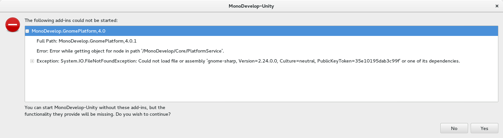

# Installing Unity on Linux (Fedora 23)
This one wasnt too bad, you will need to create a Unity account and sign in to
use Unity.

## Dependencies
none

## Install
```bash
wget http://download.unity3d.com/download_unity/unity-editor-installer-5.1.0f3+2015091501.sh
sudo bash unity-editor-installer-5.1.0f3+2015091501.sh
mkdir /usr/share/unity-editor
cp -R unity-editor-5.1.0f3/* /usr/share/unity-editor
sudo chmod 4755 /usr/share/unity-editor/Editor/chrome-sandbox
```

add `/usr/share/unity-editor/Editor` to path
run: `Unity`

## Install MonoDevelop as IDE
Note: unity appears to come with a built in version of monodevelop, Im having some
issues making it work, but the explicit install might not be required


Monodevelop uses flatpak to install, fedora repos give you a relatively old version of
flatpak so most flatpak commands you find out there dont quite work.

```bash
sudo dnf install flatpak
wget https://sdk.gnome.org/gnome.flatpakrepo
flatpak remote-add --from gnome.flatpakrepo gnome
flatpak install gnome org.freedesktop.Platform 1.4
wget https://download.mono-project.com/repo/monodevelop.flatpakref
flatpak install --user --from monodevelop.flatpakref
flatpak run com.xamarin.MonoDevelop
```

## Install Visual Studio Code as IDE
I had trouble getting built in or external MonoDevelop to work properly so I switched to
VisualStudio Code. It was simple to install/configure.

[Install Code](https://code.visualstudio.com/docs/setup/linux)

[Configure Unity](https://code.visualstudio.com/docs/other/unity) - Note: I removed the
auto-populated "External Script Editor Args" field as it seemed to be throwing things
off. Also, code seems to install to `/usr/share/code/`

## Troubleshooting

### libgpg-error starting unity
```bash
./Unity: /usr/share/unity-editor/Editor/Data/Tools/libgpg-error.so.0: no version information available (required by /lib64/libgcrypt.so.20)
./Unity: relocation error: /lib64/libgcrypt.so.20: symbol gpg_err_set_errno, version GPG_ERROR_1.0 not defined in file libgpg-error.so.0 with link time reference
```
Solution: remove `/usr/share/unity-editor/Editor/Data/Tools/libgpg-error.so.0`

### chome-sandbox permission error starting unity
```
Chromium Embedded Framework requires that the file '/usr/share/unity-editor/Editor/chrome-sandbox' is owned by root and has permissions 4755.
```
Solution: `sudo chmod 4755 /usr/share/unity-editor/Editor/chrome-sandbox`

### error opening script in monodevelop

```bash
sudo dnf install gnome-sharp
```
