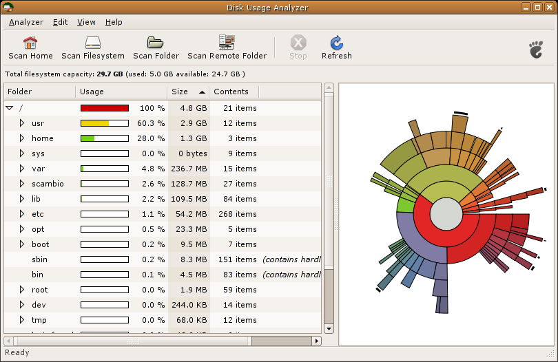

# How To: find linux disk hogs with du (and more...)

## bash-fu
show top 5 largest files/folders from current directory and subdirectories:
```bash
du -h | sort -h -r | head -n 5
```

show top 5 largest files in current directory:
```bash
find . -maxdepth 1 -type f -exec du -ah {} + | sort -n -r | head -n 5
```

sum up file + directory use space (this could take a very long time):
```bash
du / -Sh | sort -rh | head -20
```

And of course to quickly see how much space you have left:
```bash
df -h
```

## docker
If you use docker long enough it will eat up a lot of space. If du shows something
like `/var/lib/docker/devicemapper/devicemapper` taking up a lot of space get rid
of some docker images

If you are running new-ish docker you can use
[docker system prune](https://docs.docker.com/engine/reference/commandline/system_prune/):
`docker system prune --all`

Nuclear option:
```bash
# Delete all containers
docker rm $(docker ps -a -q)
# Delete all images
docker rmi $(docker images -q)
```

## Disk Usage Analyzer (aka Baobab)
If you can use a GUI this is a good tool to quickly find where your space is going.
I wish I could use it when managing hosts over ssh.



## Additional Resources
* [blog post on linux sys admin disk space cleanup](http://www.tecmint.com/find-top-large-directories-and-files-sizes-in-linux/)
* [docker remove all images and containers](https://techoverflow.net/2013/10/22/docker-remove-all-images-and-containers/)
* [stack overflow: clean up docker data](http://stackoverflow.com/questions/32723111/how-to-remove-old-and-unused-docker-images)
